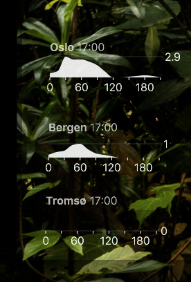

# Norway Rain Forecast Geeklet

Get three-hour rain forecasts for places in Norway on your desktop. Uses data from [api.met.no](http://api.met.no/weatherapi/nowcast/0.9/documentation).



## Usage

Install [GeekTool](https://www.tynsoe.org/v2/geektool/).

Install `geeklet-rain-norway` as a node module.

```
yarn global add geeklet-rain-norway
# or
npm install --global geeklet-rain-norway
```

To add a new Geeklet to your desktop, just run `geeklet-rain-norway`. It will ask you for a place name in Norway, try to resolve it to coordinates, generate a Geeklet configuration file and pass it to GeekTool.

(Alternatively you can clone this repository, `cd` into it, install its dependencies, and run `npm run setup`.)
